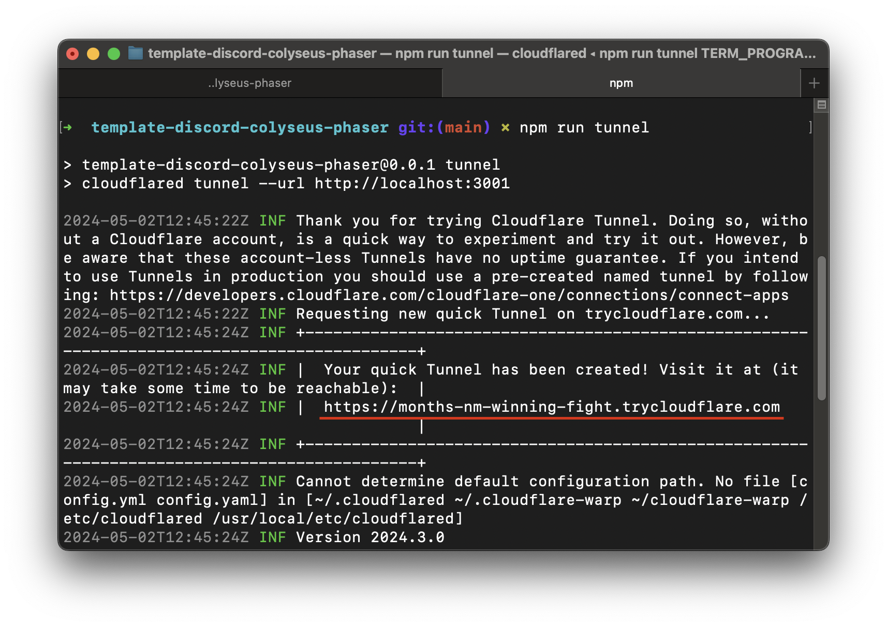
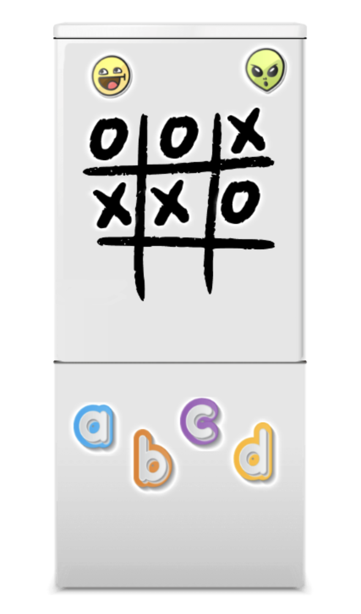

# Phaser Discord Games Template

## Creating Multiplayer Discord Games with Phaser + Colyseus

This project template is a starting point for creating multiplayer games on Discord with Colyseus and Phaser, utilising their new Embedded App SDK. It helps you seamlessly integrate custom games and activities into your Discord server, fostering community engagement, interaction, and fun.

If you haven't created any Discord activity before, we have a [comprehensive tutorial](https://phaser.io/tutorials/creating-discord-games-with-phaser) you can read on the Phaser site, which includes the steps required to create a Discord App and get your Phaser game running as an activity within it.

If you are new to Colyseus you can follow through [learn](https://colyseus.io/learn/) and [docs](https://docs.colyseus.io/).

## Installation

To get started, clone the Phaser Colyseus Discord Project Template:

```sh
git clone git@github.com:phaserjs/template-discord-colyseus-phaser.git
```

#### Set OAuth2 Credentials

Once cloned you need to set your OAuth2 credentials in the .env file.

Rename `example.env` to `.env`.
And change **VITE_DISCORD_CLIENT_ID** and **_DISCORD_CLIENT_SECRET_** variables as stored in your **_Discord App Settings -> OAuth 2_**.

```sh
VITE_DISCORD_CLIENT_ID=1234567890
DISCORD_CLIENT_SECRET=ns1234567890dc
```

Both client and server use the same `.env` file in this template. For production deployment, you will need to have seperate `.env` files for both client & server in the related directories due to releasing on different platforms(services like, Vercel, Netlify for client, and Colyseus Cloud, AWS, DigitalOcean for server).

#### Client Installation:

```sh
cd packages/client
npm i
```

#### Server Installation:

```sh
cd packages/server
npm i
```

Let's turn back to root folder, and run both client and server same time:

```sh
cd ../..
npm run dev
```

Note that, you will need to install [pnpm](https://pnpm.io/) to run in parallel for client/server commands.

It will run both client and server through `http://localhost:3000`, and our API calls will be on `http://localhost:3001`.

### Testing The Project

Firstly, we need to change `NODE_ENV` environment variable to `production` in the `.env` file.

```sh
NODE_ENV='production'
```

Now, let's change our client port from `3000` to `443`, in the `packages/client/vite.config.ts`.

To test our game on Discord Activity, we need to setup a public proxy for that. For this tutorial we will be using `cloudflared`. Our command is also ready for this. Don't forget that you need to `npm run dev` first as described above, then run this command:

```sh
npm run tunnel
```

It will start channeling our localhost to public.


Copy that generated public URL to **Discord App -> URL Mappings** and add it for the `"/"` root directory.

And voila! Ready to test our activity!



## Template Project Structure

We have provided a default project structure to get you started. This is as follows:

- `packages/client` - Contains the game & Discord SDK source code.
- `packages/client/src/main.ts` - The main entry point for the client. This contains the game & Discord SDK configuration which starts the game.
- `packages/client/src/scenes/` - The Phaser Scenes are in this folder.
- `packages/client/public/assets/` - Contains game assets(sprites, sounds, spritesheets, etc).
- `packages/client/src/utils` - Contains custom code for responsivity of the game.
- `packages/server/server.ts` - Contains Discord SDK for OAuth2 & initiates WebSocket server for Colyseus.
- `packages/server/rooms/GameRoom.ts` - Contains game session, channels communication between client/server.
- `packages/server/schemas/GameState.ts` - Defines the structure and types of data that can be synchronized between the server and client.

## Handling Assets

Vite supports loading assets via JavaScript module `import` statements.

This template provides support for both embedding assets and also loading them from a static folder. To embed an asset, you can import it at the top of the JavaScript file you are using it in:

```js
import logoImg from "./assets/logo.png";
```

To load static files such as audio files, videos, etc place them into the `client/assets` folder. Then you can use this path in the Loader calls within Phaser:

```js
preload();
{
  //  This is an example of an imported bundled image.
  //  Remember to import it at the top of this file
  this.load.image("logo", logoImg);

  //  This is an example of loading a static image
  //  from the public/assets folder:
  this.load.image("background", "assets/bg.png");
}
```

When you issue the `npm run build` command, all static assets are automatically copied to the `dist/assets` folder.

## Customizing the Template

### Vite

If you want to customize your build, such as adding plugin (i.e. for loading CSS or fonts), you can modify the `client/vite.config.js` file for cross-project changes, or you can modify and/or create new configuration files and target them in specific npm tasks inside of `package.json`. Please see the [Vite documentation](https://vitejs.dev/) for more information.

## Join the Phaser Community!

We love to see what developers like you create with Phaser! It really motivates us to keep improving. So please join our community and show-off your work 😄

**Visit:** The [Phaser website](https://phaser.io) and follow on [Phaser Twitter](https://twitter.com/phaser_)<br />
**Play:** Some of the amazing games [#madewithphaser](https://twitter.com/search?q=%23madewithphaser&src=typed_query&f=live)<br />
**Learn:** [API Docs](https://newdocs.phaser.io), [Support Forum](https://phaser.discourse.group/) and [StackOverflow](https://stackoverflow.com/questions/tagged/phaser-framework)<br />
**Discord:** Join us on [Discord](https://discord.gg/phaser)<br />
**Code:** 2000+ [Examples](https://labs.phaser.io)<br />
**Read:** The [Phaser World](https://phaser.io/community/newsletter) Newsletter<br />

Created by [Phaser Studio](mailto:support@phaser.io). Powered by coffee, anime, pixels and love.

The Phaser logo and characters are &copy; 2011 - 2024 Phaser Studio Inc.

All rights reserved.
